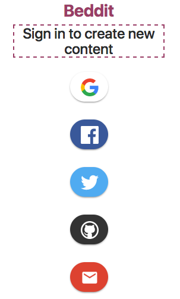

# Beddit = A Better Reddit?

## Concept

All of us are familiar with the slighly ugly-fied UI of [reddit](https://www.reddit.com/), that has captured our attention on oh so many topics.

In this project we embarked upon reproducing a similar functionality to reddit, yet adding some elements to it's visual appeal. Enter **Beddit**, a prettier version of the reddit web-app with a fleshed out UI and an authentication mechanism via familiar federated identity providers like Google, Facebook, and Twitter.

## Demo App

The end product of this group project is deployed to Heroku at the link below. Please check it out and enjoy! 

[https://murmuring-brushlands-35198.herokuapp.com/](https://murmuring-brushlands-35198.herokuapp.com/)

## Contributors

This project was completed as a collaboration between:

[Anya Derbakova](https://github.com/angrbrd) 

[Tom Chupkowski](https://github.com/tchupkowski)

[Jack Hilton](https://github.com/jhhilton)

## Technologies

The technologies used to complete this project were:

* **MySQL** - database
* **Sequelize** - ORM
* **Node.js** - server
* **Express.js** - server framework
* **Bootstrap** - front-end framework
* **HTML5** - front-end layout
* **CSS3** - front-end styling
* **JavaScript** - front-end and back-end implementation
* **jQuery** - DOM manipulation
* **Firebase** - user authentication
* **REST** - server endpoint design
* **Heroku** - application deployment
*  **Slack** - communication
*  **Github** - code repository and issue tracking
*  **[body-parser](https://www.npmjs.com/package/body-parser)** - request payload parsing
*  **[loglevel](https://www.npmjs.com/package/loglevel)** - minimalist logging framework

## Installation

If you would like to install and run this project locally, first clone this repository as follows:

	git clone git@github.com:angrbrd/message-board-group-project.git
	
Subsequently, install the necessary dependencies.

	cd message-board-group-project
	npm install
	
Run the Node.js server.

	node server.js
	
Finally, access the app within your browser on the default port of `8080` with: `localhost:8080`. Log in through one of the supported federated identity providers and make some posts!

## Future Work

Future work on this project includes but is not limited to the following:

1) Implementing a landing page for individual posts. This page would display the complete post, author information, and creation/modification date.

2) Impement the grouping tabs at the top of the UI page. These tabs would allow the user to switch views and display only their own posts or the posts that they have favorited.

3) Implement integrated chat functionality. This functionality would allow logged in users to message other users and authors of existing posts.

4) Implement pagination. This would allow the posts to be organized and displayed with a certain number of posts per page without loading all of the posts at once.

5) Consider re-writing the app in a modern front-end framework such as Angular.js.

**Happy posting!**
